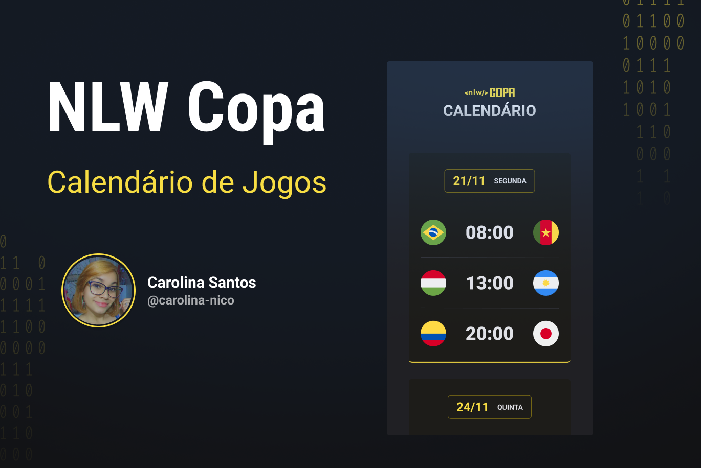

# NLW #10 Copa
### Evento exclusivo e gratuito, promovido pela [Rocketseat](https://www.rocketseat.com.br/) para ensino de tecnologias WEB.
 

<a href="#-tecnologias">Tecnologias</a>&nbsp;&nbsp;&nbsp;|&nbsp;&nbsp;&nbsp;
<a href="#-projeto">Projeto</a>&nbsp;&nbsp;&nbsp;|&nbsp;&nbsp;&nbsp;
<a href="#-layout">Layout</a>&nbsp;&nbsp;&nbsp;|&nbsp;&nbsp;&nbsp;
<a href="#-licenca">Licença</a>

 

## 🚀 Tecnologias 
Esse projeto foi desenvolvido com as seguintes tecnologias:

- [HTML](https://developer.mozilla.org/en-US/docs/Web/HTML)
- [CSS](https://developer.mozilla.org/en-US/docs/Web/CSS)
- [JAVASCRIPT](https://www.javascript.com/)

## 💻 Projeto
 O Calendário da Copa é um projeto quie mostra os Jogos da Copa de 2022.

## Layout 
Você pode visualizar o layout do projeto através [DESSE LINK](https://figma.com/file/J1Z33MISC22YZB8wfxiIns/NLW-COPA-EXPLORER/duplicate). É necessário ter conta no [Figma](https://figma.com) para acessá-lo.

## :memo: Licença
Esse projeto está sob licença MIT.
